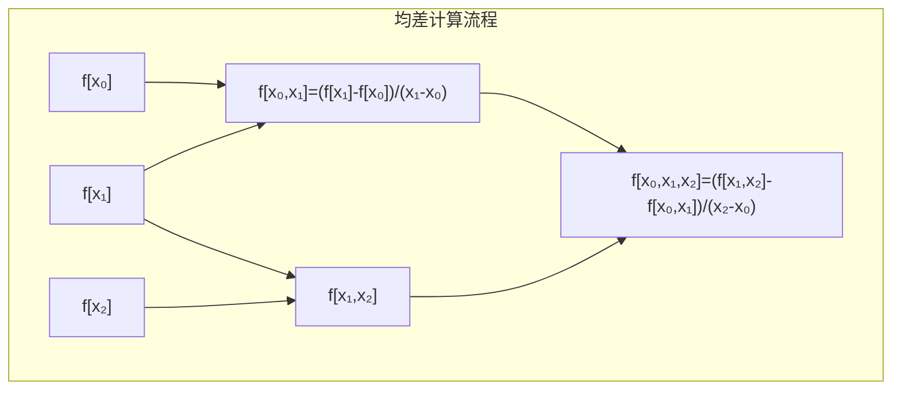
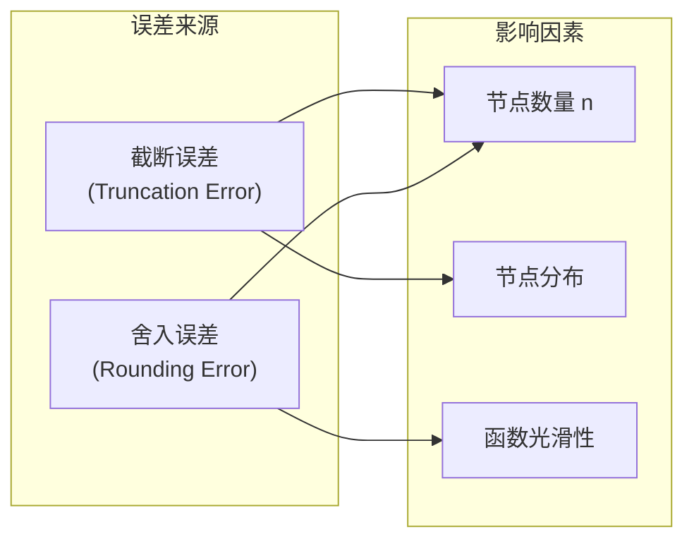

# 牛顿插值法（Newton's Interpolation）

## 一、问题引入

已知函数 $f(x)$ 在 $n+1$ 个互异节点 $x_0, x_1, \dots, x_n$ 处的函数值：

$$
f(x_i) = y_i, \quad i = 0, 1, \dots, n
$$

寻找一个**次数不超过 $n$** 的多项式 $P_n(x)$，使得：

$$
P_n(x_i) = y_i, \quad i = 0, 1, \dots, n
$$

---

## 二、为什么需要牛顿插值？

**拉格朗日插值**的基函数为：

$$
\ell_i(x) = \prod_{\substack{j=0 \\ j \neq i}}^{n} \frac{x - x_j}{x_i - x_j}
$$

其插值多项式：

$$
L_n(x) = \sum_{i=0}^{n} y_i \ell_i(x)
$$

**致命缺陷**：每增加一个新节点，所有基函数 $\ell_i(x)$ 都要重新计算，**无继承性**。

**牛顿插值的核心思想**：将插值多项式写成**逐步递推**的形式：

$$
P_n(x) = a_0 + a_1(x - x_0) + a_2(x - x_0)(x - x_1) + \cdots + a_n(x - x_0)(x - x_1)\cdots(x - x_{n-1})
$$

新增节点时只需在末尾追加一项，前面的系数**完全不变**。

---

## 三、均差（差商）—— Divided Difference

### 3.1 定义

**零阶均差**：

$$
f[x_i] = f(x_i) = y_i
$$

**一阶均差**：

$$
f[x_i, x_j] = \frac{f(x_j) - f(x_i)}{x_j - x_i}
$$

**二阶均差**（一阶均差的均差）：

$$
f[x_i, x_j, x_k] = \frac{f[x_j, x_k] - f[x_i, x_j]}{x_k - x_i}
$$

**$k$ 阶均差**：

$$
f[x_0, x_1, \dots, x_k] = \frac{f[x_1, x_2, \dots, x_k] - f[x_0, x_1, \dots, x_{k-1}]}{x_k - x_0}
$$

### 3.2 均差表

| $x_i$ | $f[x_i]$ | 一阶均差 | 二阶均差 | 三阶均差 |
|:---:|:---:|:---:|:---:|:---:|
| $x_0$ | $f[x_0]$ | | | |
| $x_1$ | $f[x_1]$ | $f[x_0,x_1]$ | | |
| $x_2$ | $f[x_2]$ | $f[x_1,x_2]$ | $f[x_0,x_1,x_2]$ | |
| $x_3$ | $f[x_3]$ | $f[x_2,x_3]$ | $f[x_1,x_2,x_3]$ | $f[x_0,x_1,x_2,x_3]$ |

### 3.3 均差的性质

1. **对称性**：均差与节点的排列顺序无关

   $$
   f[x_0, x_1, \dots, x_k] = f[x_{i_0}, x_{i_1}, \dots, x_{i_k}]
   $$

2. **与导数的关系**：若 $f \in C^n[a,b]$，则

   $$
   f[x_0, x_1, \dots, x_n] = \frac{f^{(n)}(\xi)}{n!}, \quad \xi \in (a,b)
   $$

3. **线性性**：对任意常数 $\alpha, \beta$

   $$
   (\alpha f + \beta g)[x_0, \dots, x_k] = \alpha f[x_0, \dots, x_k] + \beta g[x_0, \dots, x_k]
   $$

---

## 四、牛顿插值公式

### 4.1 基本形式

设插值基函数为：

$$
\begin{aligned}
\omega_0(x) &= 1 \\
\omega_1(x) &= (x - x_0) \\
\omega_2(x) &= (x - x_0)(x - x_1) \\
&\ \vdots \\
\omega_k(x) &= \prod_{i=0}^{k-1} (x - x_i)
\end{aligned}
$$

牛顿插值多项式：

$$
\boxed{P_n(x) = f[x_0] + \sum_{k=1}^{n} f[x_0, x_1, \dots, x_k] \cdot \omega_k(x)}
$$

展开形式：

$$
\begin{aligned}
P_n(x) =&\ f[x_0] \\
       &+ f[x_0, x_1] (x - x_0) \\
       &+ f[x_0, x_1, x_2] (x - x_0)(x - x_1) \\
       &+ \cdots \\
       &+ f[x_0, x_1, \dots, x_n] (x - x_0)(x - x_1)\cdots(x - x_{n-1})
\end{aligned}
$$

### 4.2 递推性（核心优势）

当新增节点 $x_{n+1}$ 时：

$$
P_{n+1}(x) = P_n(x) + f[x_0, x_1, \dots, x_{n+1}] \cdot \omega_{n+1}(x)
$$

前面 $n$ 项系数**完全不需要重新计算**，只需在尾部追加一项。

### 4.3 余项（误差估计）

牛顿插值多项式的余项与拉格朗日插值完全相同：

$$
R_n(x) = f(x) - P_n(x) = f[x_0, x_1, \dots, x_n, x] \cdot \prod_{i=0}^{n} (x - x_i)
$$

若 $f \in C^{n+1}[a,b]$，则可写成导数形式：

$$
R_n(x) = \frac{f^{(n+1)}(\xi)}{(n+1)!} \prod_{i=0}^{n} (x - x_i), \quad \xi \in (a,b)
$$

---

## 五、等距节点：牛顿向前/向后插值

当节点**等距分布**时，均差可简化为**差分**形式。

设 $x_i = x_0 + ih$，$h$ 为步长。

### 5.1 差分定义

| 名称 | 定义 | 符号 |
|:---|:---|:---:|
| **向前差分** | $\Delta f(x_i) = f(x_{i+1}) - f(x_i)$ | $\Delta$ |
| **向后差分** | $\nabla f(x_i) = f(x_i) - f(x_{i-1})$ | $\nabla$ |
| **中心差分** | $\delta f(x_i) = f(x_{i+\frac12}) - f(x_{i-\frac12})$ | $\delta$ |

**高阶向前差分**：

$$
\Delta^k f(x_i) = \Delta^{k-1} f(x_{i+1}) - \Delta^{k-1} f(x_i)
$$

### 5.2 差分与均差的关系

$$
f[x_0, x_1, \dots, x_k] = \frac{\Delta^k f(x_0)}{k! \, h^k}
$$

$$
f[x_{n-k}, x_{n-k+1}, \dots, x_n] = \frac{\nabla^k f(x_n)}{k! \, h^k}
$$

### 5.3 牛顿向前插值公式

令 $t = \frac{x - x_0}{h}$，则 $x = x_0 + th$：

$$
\boxed{P_n(x_0 + th) = \sum_{k=0}^{n} \binom{t}{k} \Delta^k f(x_0)}
$$

其中 $\displaystyle \binom{t}{k} = \frac{t(t-1)\cdots(t-k+1)}{k!}$ 为**广义二项式系数**。

展开前三项：

$$
P_n(x) = f(x_0) + t \Delta f(x_0) + \frac{t(t-1)}{2!} \Delta^2 f(x_0) + \frac{t(t-1)(t-2)}{3!} \Delta^3 f(x_0) + \cdots
$$

**适用场景**：在表头 $x_0$ 附近插值。

### 5.4 牛顿向后插值公式

令 $t = \frac{x - x_n}{h}$（注意此处 $t$ 为负值）：

$$
\boxed{P_n(x_n + th) = \sum_{k=0}^{n} (-1)^k \binom{-t}{k} \nabla^k f(x_n)}
$$

等价形式（令 $s = \frac{x_n - x}{h} \ge 0$）：

$$
P_n(x) = f(x_n) - s \nabla f(x_n) + \frac{s(s-1)}{2!} \nabla^2 f(x_n) - \frac{s(s-1)(s-2)}{3!} \nabla^3 f(x_n) + \cdots
$$

**适用场景**：在表尾 $x_n$ 附近插值。

---

## 六、实例演示

### 示例数据

| $x$ | 0 | 1 | 2 | 3 |
|:---:|:---:|:---:|:---:|:---:|
| $f(x)$ | 1 | 2 | 9 | 28 |

### 构建均差表

```text
 xᵢ | f[xᵢ] | 一阶    | 二阶    | 三阶
────┼───────┼─────────┼─────────┼───────
 0  |   1   |         |         |
    |       | (2-1)/(1-0)=1 |     |
 1  |   2   |         | (7-1)/(2-0)=3 |
    |       | (9-2)/(2-1)=7 |     | (3-3)/(3-0)=0
 2  |   9   |         | (19-7)/(3-1)=6 |
    |       | (28-9)/(3-2)=19|     |
 3  |  28   |         |         |
```

### 写出牛顿插值多项式

$$
\begin{aligned}
P_3(x) =&\ 1 + 1(x - 0) + 3(x - 0)(x - 1) + 0(x - 0)(x - 1)(x - 2) \\
       =&\ 1 + x + 3x(x - 1) \\
       =&\ 1 + x + 3x^2 - 3x \\
       =&\ 3x^2 - 2x + 1
\end{aligned}
$$

验证：$P_3(0)=1,\ P_3(1)=2,\ P_3(2)=9,\ P_3(3)=28$ ✅



---

## 七、误差可视化分析



**龙格现象（Runge's phenomenon）**：高次多项式插值（$n$ 较大）在区间端点附近可能出现剧烈震荡。

**改进方案**：
- 分段低次插值（分段线性、分段三次 Hermite）
- **样条插值**（Spline Interpolation）
- 切比雪夫节点（Chebyshev nodes）替代等距节点

---

## 八、算法伪代码

### 8.1 计算均差

```
输入: 节点 x[0..n], 函数值 y[0..n]
输出: 均差表 F[0..n][0..n]

for i = 0 to n:
    F[i][0] = y[i]

for k = 1 to n:
    for i = 0 to n-k:
        F[i][k] = (F[i+1][k-1] - F[i][k-1]) / (x[i+k] - x[i])

return F[0][0..n]  // 第一行即为所需均差
```

### 8.2 计算牛顿插值

```
输入: x[0..n], coeff[0..n], 插值点 t
输出: 插值结果 P(t)

result = coeff[0]
term = 1

for i = 1 to n:
    term = term * (t - x[i-1])
    result = result + coeff[i] * term

return result
```

---

## 九、与拉格朗日插值的对比

| 特性 | 拉格朗日插值 | 牛顿插值 |
|:---|:---:|:---:|
| 基函数 | $\ell_i(x)$ 与所有节点相关 | $\omega_k(x)$ 仅依赖前 $k$ 个节点 |
| 新增节点 | 全部重建 | 追加一项 |
| 计算效率（$n$ 个节点） | $O(n^2)$ | $O(n^2)$（均差表） |
| 递推复用 | ❌ | ✅ |
| 数值稳定性 | 中等 | 中等 |
| 代码实现复杂度 | 简单 | 稍复杂 |

---

## 十、应用场景

1. **数值逼近**：用低次多项式近似复杂函数
2. **数据拟合**：对离散实验数据进行插值
3. **数值积分**：牛顿-柯特斯公式（Newton-Cotes formulas）
4. **数值微分**：基于插值多项式求导
5. **图像处理**：图像缩放中的像素插值
6. **计算机图形学**：贝塞尔曲线与 B 样条的基础理论

---

> **参考书目**：
> - Burden, R. L. & Faires, J. D. *Numerical Analysis* (10th ed.)
> - 李庆扬等. 《数值分析》（第5版）
